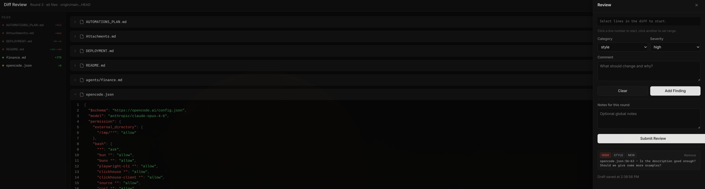

# opencode-diffs

An [OpenCode](https://opencode.ai) plugin that adds a `/diff-review` command for browser-based code review powered by [@pierre/diffs](https://diffs.com).



## How it works

When you run `/diff-review` inside an OpenCode session, the plugin:

1. **Collects diffs** from your git working tree (or between a base branch and HEAD)
2. **Starts a local HTTP server** and opens a review UI in your browser
3. **Waits for you to review** — you annotate lines in the diff with findings (category, severity, comment)
4. **Returns structured results** to OpenCode when you submit, so the AI can propose a fix strategy

The idea is to give you a visual, interactive way to review code changes before asking the AI to act on them. Instead of describing problems in chat, you click on the exact lines, categorize the issue, and write a short comment. The AI then receives all your findings as structured data and can reason about fixes more precisely.

### Review flow

```
You run /diff-review
    → Plugin reads git diff
    → Browser opens with syntax-highlighted diffs
    → You click lines, add findings (bug/style/perf/question + severity + comment)
    → You hit "Submit Review"
    → Plugin returns findings to OpenCode
    → AI proposes a fix plan based on your annotations
```

### Multi-round reviews

Each session tracks review rounds. When you run `/diff-review` again in the same session, findings from previous rounds carry over. If a file was removed or the anchored code changed, old findings are automatically closed. This lets you do iterative review — submit findings, let the AI fix things, then review the new diff.

### State and exports

Review state is persisted to `.opencode/reviews/<session>/`. Each round produces:
- `state.json` — full session state with all findings across rounds
- `round-NNN.json` — snapshot of findings for that round
- `round-NNN.md` — markdown summary

Drafts are auto-saved as you work, so you can close the browser and reopen without losing progress.

---

## Setup

Add `"opencode-diffs"` to the `plugin` array in your `opencode.json`:

```json
{
  "plugin": ["opencode-diffs"]
}
```

OpenCode will install the plugin automatically. This registers the `/diff-review` slash command.

## Usage

Review your working tree changes:

```
/diff-review
```

Review against a specific branch:

```
/diff-review --base origin/main
```

Filter to specific files:

```
/diff-review --files src/foo.ts,src/bar.ts
```

Combine flags:

```
/diff-review --base origin/main --files src/foo.ts
```

## Review UI

The browser UI has three main areas:

- **Sidebar** (left) — lists all changed files with add/delete stats. Click a file to scroll to it.
- **Diff cards** (center) — syntax-highlighted diffs for each file. Click line numbers to select a range. Files can be collapsed and marked as read.
- **Review drawer** (right) — opens when you select lines. Pick a category (`bug`, `style`, `perf`, `question`), severity (`high`, `medium`, `low`), write a comment, and click "Add Finding".

Findings from prior rounds appear with a "Resolve" button. The drawer also has a notes field for general observations and the submit button.

Light/dark mode follows your system preference, or you can toggle it manually.

## Development

```bash
bun install
bun run build        # build plugin + UI
bun run lint         # lint with oxlint
bun run format       # format with oxfmt
bun run typecheck    # type-check with tsc
bun run check        # all three checks
```

## License

MIT
